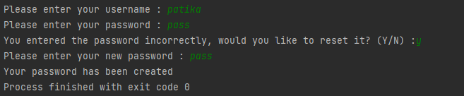

# Homework
* If the password is incorrect, ask the user if they want to reset their password. If the user wants to reset it, check that the new password they enter is not the same as the incorrect or forgotten password. If the passwords are the same, display 'Password could not be created, please enter a different password.' If not, display 'Your password has been created' and update the user's password with the new one.
## Output
